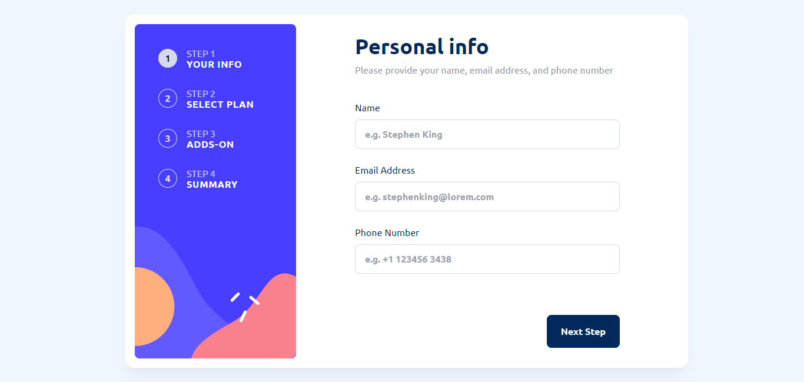
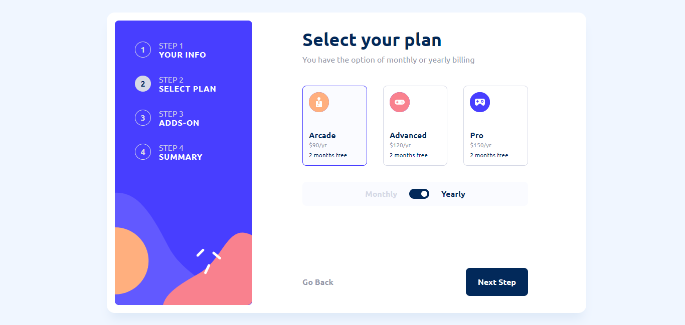
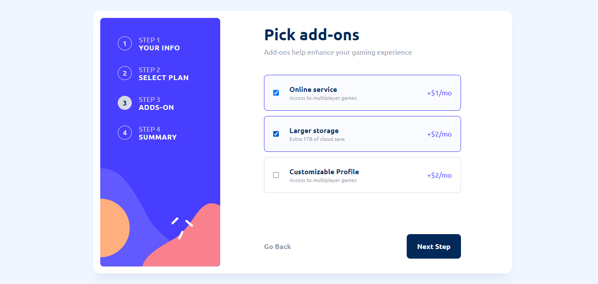
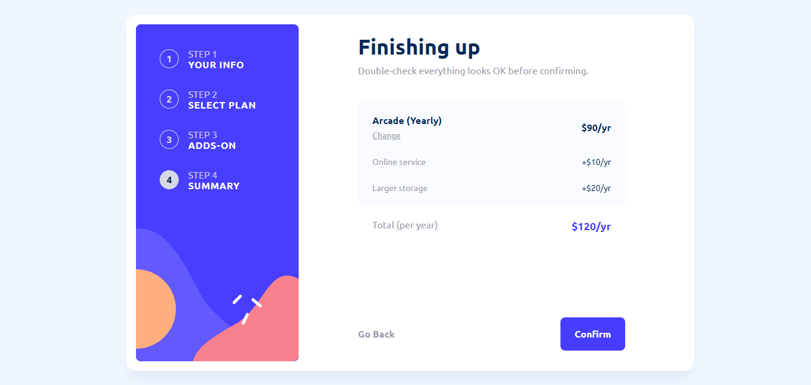

# Frontend Mentor - Multi-step form solution

This is a solution to the [Multi-step form challenge on Frontend Mentor](https://www.frontendmentor.io/challenges/multistep-form-YVAnSdqQBJ). Frontend Mentor challenges help you improve your coding skills by building realistic projects.

## Table of contents

- [Overview](#overview)
  - [The challenge](#the-challenge)
  - [Screenshot](#screenshot)
  - [Links](#links)
- [My process](#my-process)
  - [Built with](#built-with)
  - [What I learned](#what-i-learned)
  - [Useful resources](#useful-resources)
- [Author](#author)

## Overview

### The challenge

Users should be able to:

- Complete each step of the sequence
- Go back to a previous step to update their selections
- See a summary of their selections on the final step and confirm their order
- View the optimal layout for the interface depending on their device's screen size
- See hover and focus states for all interactive elements on the page
- Receive form validation messages if:
  - A field has been missed
  - The email address is not formatted correctly
  - A step is submitted, but no selection has been made

### Screenshot

### Links

- Solution URL: [https://github.com/riansyh/multi-step-form](https://github.com/riansyh/multi-step-form)
- Live Site URL: [Vercel Link](https://multi-step-form-eight-sigma.vercel.app/)

## My process

### Built with

- Flexbox
- Vue 3 Composisiton API
- Vee Validate - For form validation
- [Vue](https://vuejs.org/) - JS library
- [Tailwind CSS](https://tailwindcss.com/) - For styles

### What I learned

As a beginner in Vue, I learned more about how to use Vue 3 fundamentals and concepts using the Composition API style through this project, such as:

- ref
- reactive
- watch
- computed
- provide / inject for dependency injection

### Useful resources

- [Vue Documentation](https://vuejs.org/guide/) - This helped me to implemented every Vue feature and guide to create this project using vue.
- [Vuemastery Courses](Vuemastery.com/) - This is an free course which helped me to understand the Vue 3 fundamentals & concepts.

## Author

- Website - [riansyh](https://www.riansyh.tech)
- Frontend Mentor - [@riansyh](https://www.frontendmentor.io/profile/riansyh)
